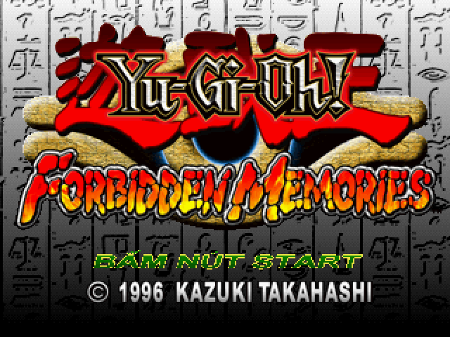
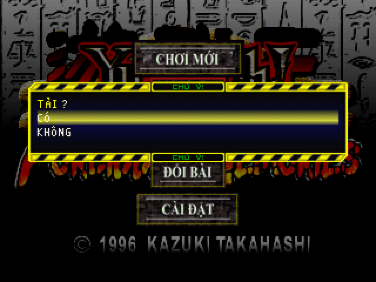
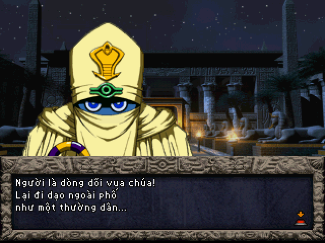
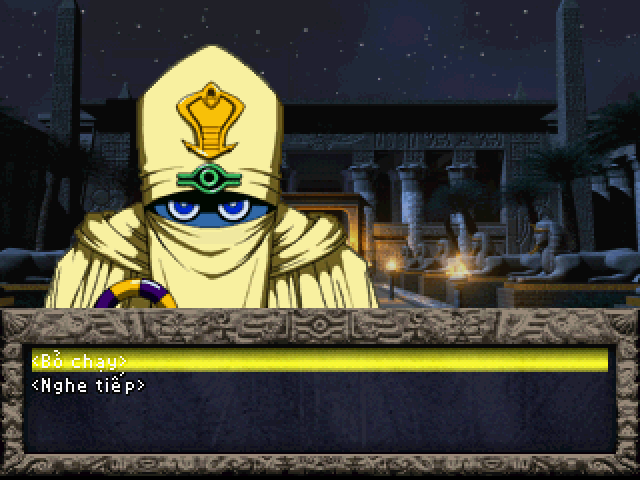
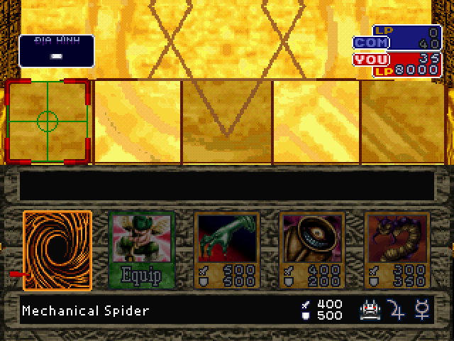
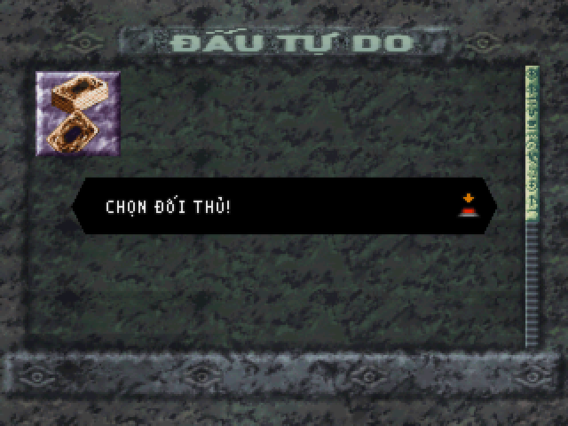
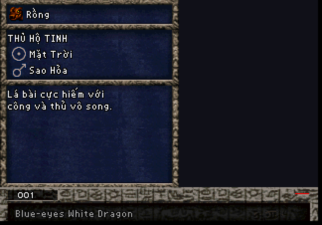
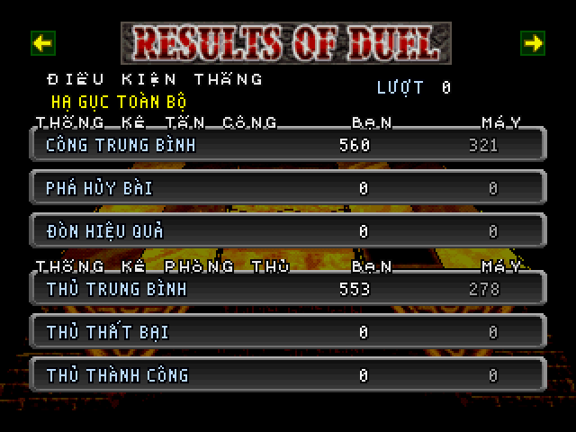
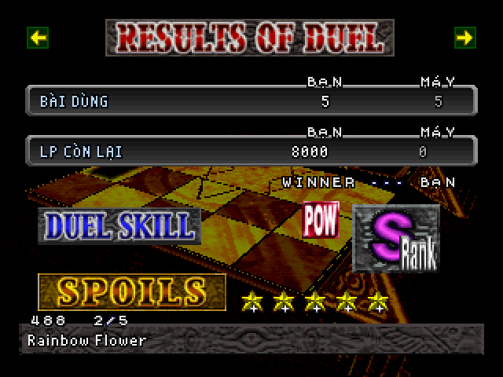
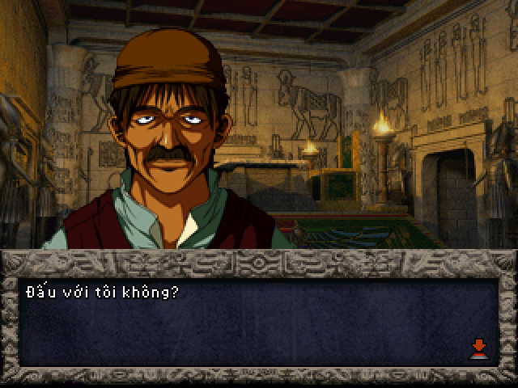

# Yu-Gi-Oh! Forbidden Memories — bản dịch tiếng Việt

Bản vá (patch) Việt hoá cho trò chơi PlayStation 1 *Yu-Gi-Oh! Forbidden
Memories* (Konami, bản Mỹ phát hành năm 2002, mã đĩa **SLUS-01411**).

Đây là dự án của người hâm mộ, không liên quan tới Konami. Gói này **không
chứa** đĩa gốc hay bất kỳ dữ liệu nào của trò chơi. Bạn cần có ảnh đĩa gốc của
chính mình; bản vá chỉ ghi phần chữ tiếng Việt, phông chữ và vài byte mã điều
chỉnh lên ảnh đĩa đó.

## Hai phiên bản — chọn một

| Bản vá | Nội dung | Dành cho |
|---|---|---|
| `yugioh-fm-vi.ppf` | **Chỉ dịch.** Lối chơi giữ nguyên như bản gốc: thắng một trận được **1** lá bài. | Người muốn chơi đúng trò chơi gốc bằng tiếng Việt. |
| `yugioh-fm-vi-5-la.ppf` | **Dịch + mod 5 lá.** Giống hệt bản trên, thêm: thắng một trận được **5** lá bài (xem mục 6). | Người thấy việc gom bài của bản gốc quá chậm. |

Cả hai bản vá đều áp **trực tiếp lên ảnh đĩa gốc** (không áp bản này chồng lên
bản kia). Muốn đổi sang bản còn lại thì áp lại từ bản sao của đĩa gốc. Thẻ nhớ
dùng chung được giữa hai bản (mục 7).

Nội dung gói:

| File | Dùng để |
|---|---|
| `yugioh-fm-vi.ppf` | Bản vá chỉ dịch, định dạng PPF 3.0 (chuẩn quen thuộc cho PS1) |
| `yugioh-fm-vi-5-la.ppf` | Bản vá dịch + mod 5 lá, định dạng PPF 3.0 |
| `apply_patch.py` | Trình áp vá bằng Python: nhận ra bản vá nào, tự kiểm SHA-256 trước và sau, tự tạo `.cue` |
| `tao_cue.bat` | Tạo file `.cue` đúng tên cho file `.bin` (kéo thả hoặc nháy đúp) |
| `README.md` | Hướng dẫn này |

**Đã dịch (cả hai bản):** mô tả của cả 722 lá bài, toàn bộ cốt truyện và hội
thoại, thông báo hệ thống, loại bài, sao hộ mệnh, danh hiệu, địa danh trên bản
đồ, các nút menu, màn tiêu đề, banner Đấu tự do, tên địa hình trong trận đấu,
màn kết quả trận đấu (chữ vẽ KẾT QUẢ TRẬN ĐẤU, ĐÁNH GIÁ, PHẦN THƯỞNG, Hạng, và
các nhãn chữ nhỏ BẠN / MÁY, ĐIỀU KIỆN THẮNG, THỐNG KÊ…). Chữ có dấu đầy đủ, phông chữ vẽ lại với độ rộng chữ thay đổi theo từng ký tự.

**Giữ tiếng Anh có chủ đích:** tên lá bài (để dễ tra cứu, trao đổi mật mã),
WIN / LOSE, WINNER, LP, COM / YOU trên sân đấu, thanh CHEST / ORDER ở màn xếp
bài, nút END ở màn nhập tên, bảng luật đấu 2 người, POW / TEC (kiểu thắng) ở màn
kết quả.

**Chưa kiểm tra trực tiếp trong game:** các hộp thoại chỉ hiện khi thẻ nhớ gặp
vấn đề (ghi đè, định dạng…; đã kiểm bằng cách dựng lại chữ từ dữ liệu game), bảng
luật đấu 2 người, và 6 tên địa hình chỉ hiện
khi đánh lá bài địa hình (đã kiểm bằng ảnh ghép từ dữ liệu game). Gặp lỗi ở các
chỗ này xin báo lại theo mục 9.

---

## Hình ảnh

| | |
|---|---|
|  |  |
| Màn tiêu đề | Menu tiêu đề, hộp thoại Tải |
|  |  |
| Cốt truyện | Lựa chọn trong hội thoại |
|  |  |
| Trận đấu | Đấu tự do |
|  |  |
| Mô tả lá bài trong Thư viện | Màn kết quả, trang thống kê (cả hai bản) |
|  |  |
| Màn kết quả của **bản 5 lá**: lá thứ 3 trong 5 lá thắng được | Xưng hô theo nhân vật: dân làng lớn tuổi xưng "tôi" |

## 1. Chuẩn bị ảnh đĩa gốc

Bạn cần ảnh đĩa dạng **`.bin` + `.cue`** (Mode 2, 2352 byte mỗi sector) của
đĩa Mỹ SLUS-01411. Đây là định dạng mà các phần mềm đọc đĩa PS1 phổ biến
(ImgBurn, CDRDAO, Alcohol 120%…) xuất ra khi chọn kiểu "BIN/CUE". Một số lưu ý:

- Ảnh đĩa phải có **đúng một file `.bin`**. Nếu `.cue` của bạn liệt kê nhiều
  file (Track 01, Track 02…), đó là kiểu chia track, không dùng trực tiếp được.
- File `.iso` (2048 byte mỗi sector) **không** dùng được: bản vá tính theo
  sector 2352 byte có mã sửa lỗi.
- Kích thước đúng của `.bin`: **517.872.768 byte** (220.184 sector).

Bản vá được tạo từ đúng một ảnh đĩa; ảnh khác dù "cùng game" cũng có thể lệch
vài byte. Vì vậy phải kiểm SHA-256 trước khi áp.

## 2. Kiểm SHA-256 của ảnh đĩa gốc

SHA-256 là "dấu vân tay" của file: hai file giống nhau từng byte thì ra cùng
một chuỗi 64 ký tự. Ảnh đĩa gốc phải cho ra đúng:

```
6e22494a45bf50fa2d239cd3819a57163a5f9b91e0365babc3e101509b5c3a7c
```

Cách tính trên từng hệ điều hành (thay `TEN_FILE.bin` bằng tên file của bạn;
nếu đường dẫn có khoảng trắng thì đặt trong dấu ngoặc kép):

**Windows, dùng Command Prompt (cmd):**

```
certutil -hashfile "TEN_FILE.bin" SHA256
```

Mở cmd bằng cách gõ `cmd` vào ô tìm kiếm của Start; dùng lệnh `cd` để vào thư
mục chứa file, hoặc kéo thả file vào cửa sổ cmd để dán đường dẫn. Kết quả hiện
ở dòng thứ hai, có thể có khoảng trắng giữa các cặp ký tự, cứ bỏ khoảng trắng
mà so.

**Windows, dùng PowerShell:**

```
Get-FileHash "TEN_FILE.bin" -Algorithm SHA256
```

Cột `Hash` là kết quả (chữ in hoa, so không phân biệt hoa thường).

**macOS (Terminal):**

```
shasum -a 256 "TEN_FILE.bin"
```

**Linux:**

```
sha256sum "TEN_FILE.bin"
```

File khoảng 500 MB nên tính mất chừng mười giây. Chỉ cần so **8 ký tự đầu** là
đủ để nhận ra: đĩa gốc đúng bắt đầu bằng `6e22494a`. Nếu khác, xem mục 8.

## 3. Áp vá — cách 1: PPF-O-Matic (Windows, không cần cài gì)

PPF-O-Matic là công cụ nhỏ, miễn phí, chuyên áp bản vá PPF cho đĩa PS1; tìm
"PPF-O-Matic 3" trên các trang lưu trữ công cụ ROM hacking.

1. **Sao chép** file `.bin` gốc ra một bản khác và đặt tên theo bản bạn chọn:
   `Yu-Gi-Oh! Forbidden Memories (VN).bin` (chỉ dịch) hoặc
   `Yu-Gi-Oh! Forbidden Memories (VN)(Mod5).bin` (dịch + 5 lá). PPF-O-Matic
   sửa thẳng vào file được chọn, nên luôn giữ lại bản gốc.
2. Mở PPF-O-Matic. Ô **ISO file**: chọn bản sao vừa tạo. Ô **Patch**: chọn
   **một** trong hai file `yugioh-fm-vi.ppf` hoặc `yugioh-fm-vi-5-la.ppf`.
3. Bấm **Apply**. Chỉ vài giây, chương trình báo "Successfully patched".
4. Kiểm lại theo mục 5.

Không áp file PPF thứ hai lên file đã vá: hai bản vá đều tính từ đĩa gốc.

## 4. Áp vá — cách 2: Python (Windows, macOS, Linux)

Cần Python 3 (tải từ python.org; trên Windows khi cài nhớ tick "Add Python to
PATH"). Cách này **không sửa** file gốc mà tạo file mới, và tự kiểm SHA-256.

1. Đặt `apply_patch.py`, file `.ppf` bạn chọn và file `.bin` gốc vào cùng một
   thư mục.
2. Mở cmd / PowerShell / Terminal tại thư mục đó và chạy **một** trong hai lệnh:

Bản chỉ dịch:

```
python apply_patch.py "TEN_FILE_GOC.bin" yugioh-fm-vi.ppf
```

Bản dịch + 5 lá:

```
python apply_patch.py "TEN_FILE_GOC.bin" yugioh-fm-vi-5-la.ppf
```

(Trên macOS/Linux nếu `python` không có thì dùng `python3`.)

File ra được đặt cạnh file gốc, tên mặc định:

| Bản vá | File ra |
|---|---|
| `yugioh-fm-vi.ppf` | `Yu-Gi-Oh! Forbidden Memories (VN).bin` + `.cue` |
| `yugioh-fm-vi-5-la.ppf` | `Yu-Gi-Oh! Forbidden Memories (VN)(Mod5).bin` + `.cue` |

Muốn tên khác thì thêm tên file ra làm tham số thứ ba, ví dụ
`python apply_patch.py "TEN_FILE_GOC.bin" yugioh-fm-vi.ppf "ten-cua-toi.bin"`.
Nếu thư mục đã có file cùng tên, file đó bị ghi đè.

3. Kịch bản kiểm SHA-256 của file gốc trước; nếu không đúng nó dừng lại và báo
   "Dia goc khong dung". Nếu đúng, nó in tên bản vá đang áp (`chi dich` hoặc
   `dich + 5 la moi tran`), ghi ra file `.bin` mới, in SHA-256 của file mới và
   báo `KHOP ban phat hanh` khi kết quả chuẩn.
4. Kịch bản **tự tạo luôn file `.cue`** cạnh file `.bin` mới, đúng tên, nên bỏ
   qua bước tạo `.cue` bằng tay ở mục 5.

Có thể tạo cả hai bản từ cùng một file gốc (chạy lần lượt hai lệnh trên), vì
file gốc không bị sửa.

## 5. Kiểm kết quả

Tính SHA-256 của file đã vá (cùng cách ở mục 2). Kết quả đúng:

| Bản vá | SHA-256 của file đã vá |
|---|---|
| `yugioh-fm-vi.ppf` (chỉ dịch) | `27557b2bcf5872e93d776a52a2531d9a2079f17ca11c9566f4a2a7526234dd0c` |
| `yugioh-fm-vi-5-la.ppf` (dịch + 5 lá) | `48de3b1cd47eb1d590e794a8517f18b45584a47f7b4a9d053be3d10e78984727` |

Chỉ cần so 8 ký tự đầu: bản chỉ dịch bắt đầu bằng `27557b2b`, bản 5 lá bắt đầu
bằng `48de3b1c`. Đúng chuỗi này thì file của bạn giống từng byte với bản đã
được kiểm thử; mọi lỗi nếu có sẽ không phải do bước áp vá.

Nếu áp bằng PPF-O-Matic thì cần thêm file `.cue` cho đĩa mới (cách Python đã
tự tạo sẵn). Nhanh nhất: **kéo thả file `.bin` đã vá lên `tao_cue.bat`**, hoặc
chép `tao_cue.bat` vào cùng thư mục rồi nháy đúp — nó tạo `.cue` đúng tên cho
mọi file `.bin` ở đó. Muốn làm tay thì sao chép file `.cue` gốc, đổi tên cho
trùng tên file `.bin` đã vá, mở bằng Notepad và sửa tên file `.bin` ở dòng đầu
cho khớp. Nội dung chuẩn chỉ có ba dòng, ví dụ:

```
FILE "Yu-Gi-Oh! Forbidden Memories (VN).bin" BINARY
  TRACK 01 MODE2/2352
    INDEX 01 00:00:00
```

## 6. Bản 5 lá khác gì

Chỉ có ở `yugioh-fm-vi-5-la.ppf`; mọi thứ khác giống hệt bản chỉ dịch.

- **Thắng một trận được 5 lá bài thay vì 1.** Cả 5 lá đều rút ngẫu nhiên từ
  bài rơi của đối thủ, theo đúng cách bản gốc chọn lá thưởng (cùng bảng bài
  rơi, cùng hạng S/A/B, POW/TEC). Mỗi lá được rút riêng nên có thể trùng nhau.
- **Màn kết quả hiện đủ 5 lá.** Ô SPOILS ghi số lá và thứ tự, ví dụ
  `488   2/5`, dòng dưới là tên lá. Lá tự đổi sau khoảng 3 giây; bấm
  **↓** để xem lá kế tiếp, **↑** để xem lá trước. Nút ← / → vẫn chuyển trang
  kết quả như bản gốc.
- Khi đóng màn kết quả (nút X như bình thường), cả 5 lá được cất vào rương
  (CHEST) và vào danh sách bài mới. Mỗi loại bài vẫn tối đa 250 lá như bản gốc.
- Thua trận không được lá nào, như bản gốc.
- Các trận không có phần thưởng ở bản gốc thì bản 5 lá cũng không có.

Mod này làm việc gom bài nhanh hơn nhiều, nên trò chơi dễ hơn bản gốc.

## 7. Chạy trên giả lập

Mở file **`.cue`** (không phải `.bin`) bằng giả lập. Đã thử trên PCSX-Redux;
DuckStation, ePSXe, Mednafen/Beetle PSX đều đọc được BIN/CUE.

- Thẻ nhớ (save trong game) dùng bình thường, kể cả save từ bản tiếng Anh:
  bản vá không đổi cấu trúc dữ liệu lưu, lá bài và mật mã giữ nguyên.
- Save của bản chỉ dịch và bản 5 lá **dùng chung được**, có thể chuyển qua lại.
  Lá bài đã thắng bằng bản 5 lá vẫn còn nguyên khi quay về bản chỉ dịch.
- **Không nạp save state** (lưu nhanh của giả lập, kiểu F5/F7) được tạo trên
  bản khác (bản tiếng Anh, hoặc bản vá còn lại): save state giữ nguyên toàn bộ
  bộ nhớ lúc lưu, nên vẫn chạy code và chữ cũ dù đĩa mới đã đúng. Vào game bằng
  "Tiếp tục" từ thẻ nhớ.
- Mật mã lá bài (8 chữ số) giữ nguyên như bản gốc, tra cứu theo tên tiếng Anh.

## 8. Khi SHA-256 không khớp

- **Ảnh gốc ra chuỗi khác `6e22494a…`:** ảnh đĩa của bạn không phải bản mà bản
  vá được tạo từ đó. Nguyên nhân hay gặp: đọc đĩa ra kiểu `.iso` 2048 byte
  (kích thước sẽ nhỏ hơn 500 MB nhiều), đọc thiếu hoặc thừa sector cuối, đĩa
  thuộc bản in khác (bản châu Âu SLES có dữ liệu khác, không dùng được), hoặc file
  từng bị áp một bản vá khác. Cách chắc nhất là đọc lại từ đĩa thật bằng
  ImgBurn ở chế độ BIN/CUE. Bản vá áp lên ảnh sai vẫn chạy được phần lớn,
  nhưng có thể lỗi ở chỗ không lường trước.
- **Ảnh đã vá ra chuỗi khác bảng ở mục 5:** bạn đã áp lên ảnh gốc sai (xem
  trên), áp lên file đã bị sửa khác, hoặc áp **cả hai** bản vá lên cùng một
  file. Làm lại từ bản sao gốc, mỗi file chỉ áp một bản vá.

## 9. Câu hỏi thường gặp

**Có thể dùng bản vá xdelta không?** Gói này phát hành PPF vì là chuẩn lâu năm
cho PS1. Ai có sẵn hai ảnh đĩa có thể tự tạo xdelta bằng xdelta UI, kết quả
tương đương.

**Tại sao phải kiểm SHA-256 kỹ vậy?** Vì các lỗi khó chịu nhất (đứng máy, mất
chữ) thường bắt nguồn từ chỉ vài byte lệch. Kiểm hash là cách duy nhất biết
chắc file của bạn giống file đã được thử.

**Có bản "5 lá" mà không dịch không?** Không. Mod 5 lá chỉ phát hành kèm bản
dịch.

**Báo lỗi ở đâu?** Mở issue trên repo này, kèm: bạn dùng bản vá nào, SHA-256
của file đã vá, tên giả lập, và ảnh chụp màn hình cùng câu thoại cuối cùng
trước khi lỗi.

## 10. Lịch sử phiên bản

- **Bản hiện tại:** sửa lỗi **treo máy** khi chọn "VỀ MÀN TIÊU ĐỀ" ở cửa hàng bài
  (menu xác nhận nay là KO / CÓ). Hộp thoại định dạng thẻ nhớ thành "XÓA THẺ? / HỦY /
  CÓ". Menu cửa hàng căn giữa đều các dòng. Xưng hô thoại theo từng nhân vật (dân làng
  lớn tuổi xưng "tôi", Simon/Sadin "thần – Người", pháp sư "ta/bọn ta – ngươi"…).
  SHA-256: bản chỉ dịch `27557b2b…`, bản 5 lá `48de3b1c…`. **Ai đang dùng bản trước nên áp lại bản này.**
- **Bản thứ ba:** câu thoại được dồn dòng: mỗi dòng lấp đầy ô thoại rồi mới
  xuống dòng (736 trang thoại, kể cả câu có tên người chơi; không tách từ ghép
  như "pháp sư", "sức mạnh"; tiếng hét kéo dài giữ nguyên). Bỏ khoảng hở thừa
  trước tên người chơi. Màn kết quả: vẽ lại chữ KẾT QUẢ TRẬN ĐẤU, ĐÁNH GIÁ,
  PHẦN THƯỞNG, Hạng; cột số BÀI DÙNG / LP CÒN LẠI thẳng hàng. Sửa các hộp thoại
  thẻ nhớ: bỏ chữ viết tắt "Đ.DẠNG" (nay là "ĐỊNH DẠNG"),
  bỏ khoảng hở trong "TẢI ?", "LƯU ?", "TẢI VỀ  XONG!", bỏ dòng bị thụt đầu
  ("ĐỪNG CẮM/RÚT THẺ NHỚ" / "Ở KHE THẺ NHỚ 1"). Thêm dấu câu còn thiếu ở 11 câu
  thoại. SHA-256: bản chỉ dịch `f6c5dd1d…`, bản 5 lá `0e69edd2…`.
- **Bản thứ hai:** thêm bản vá `yugioh-fm-vi-5-la.ppf` (5 lá mỗi trận thắng,
  màn kết quả hiện đủ 5 lá). Sửa màn kết quả ở cả hai bản: các nhãn chữ nhỏ
  (BẠN / MÁY, ĐIỀU KIỆN THẮNG, THỐNG KÊ TẤN CÔNG / PHÒNG THỦ) trước đây mất chữ
  có dấu và BẠN / MÁY lệch khỏi cột số liệu. SHA-256: bản chỉ dịch `e509924b…`,
  bản 5 lá `3daf6f6c…`.
- **Bản đầu tiên:** `yugioh-fm-vi.ppf`, SHA-256 file đã vá `685e55bf…`.

## 11. Bản quyền

Trò chơi, tên gọi, hình ảnh và âm thanh thuộc Konami và các chủ sở hữu liên
quan. Bản vá chỉ chứa phần chữ dịch, phông chữ vẽ lại và các byte mã điều
chỉnh, không phân phối dữ liệu gốc. Nếu chủ sở hữu bản quyền yêu cầu, bản vá
sẽ được gỡ.

---

Bản dịch do **Khuong Doan** thực hiện — <https://khuongdoan.com/>

<sub>Bản vá miễn phí và sẽ luôn như vậy. Nếu nó giúp bạn chơi lại trò chơi tuổi thơ và bạn muốn mời tác giả một ly cà phê, quét mã MoMo bên dưới. Không bắt buộc, không kèm quyền lợi gì thêm.</sub>

<a href="https://github.com/2ez4gcx/Project-hub/blob/main/docs/anh/ung-ho-momo.png"></a>
